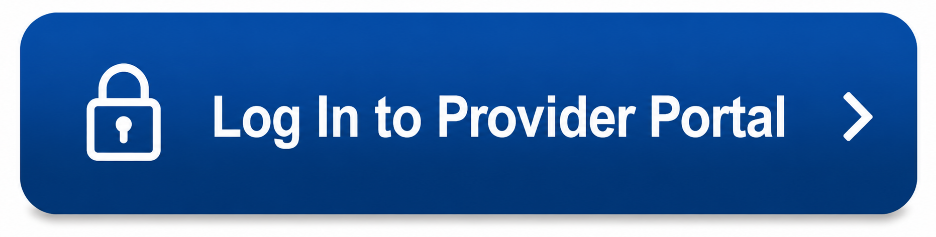

Bankers Fidelity Provider Portal Login & Eligibility
====================================================

The **Bankers Fidelity Provider Portal** allows healthcare providers to securely access patient and policy information online. After signing in, providers can verify patient eligibility, check Medicare Supplement coverage, view claim status, access Explanation of Benefits (EOBs), and manage their provider account.

This guide explains how to log in to the Bankers Fidelity Provider Portal, access your account, check patient eligibility, register as a new provider, recover your login credentials, troubleshoot common login issues, and use the portal's key features.

Bankers Fidelity Provider Portal Login
--------------------------------------

#. Visit the official Bankers Fidelity Provider Portal.
#. Enter your registered **User ID**.
#. Enter your **Password**.
#. Complete any required security verification.
#. Click **Log In** to access your provider account.

After signing in successfully, you can verify eligibility, review claims, and access other provider services.

How to Access the Bankers Fidelity Provider Portal
--------------------------------------------------

The provider portal is available online and can be accessed from any supported web browser.

To access your account:

#. Open the official Provider Portal.
#. Enter your login credentials.
#. Complete any required authentication.
#. Access your provider dashboard.

Once logged in, you'll have secure access to patient and policy information.

How to Check Patient Eligibility
--------------------------------

Providers can quickly verify patient eligibility through the portal.

#. Log in to your provider account.
#. Select the **Eligibility** section.
#. Enter the required patient information.
#. Submit the request.
#. Review the patient's eligibility status, coverage details, and effective dates.

Benefits of Using the Bankers Fidelity Provider Portal
------------------------------------------------------

The Provider Portal offers several helpful features:

* Verify patient eligibility.
* Review Medicare Supplement coverage.
* Check claim status.
* Access Explanation of Benefits (EOBs).
* View policy information.
* Manage provider account details securely.
* Save time with online self-service tools.

Provider Portal Registration
----------------------------

If you are a new provider, create an account by following these steps:

#. Select **Register** on the Provider Portal.
#. Enter your provider information.
#. Provide your **NPI** or **TIN**.
#. Create your User ID and Password.
#. Complete the registration and verification process.

Forgot User ID or Password?
---------------------------

If you're unable to sign in:

#. Select **Forgot User ID** or **Forgot Password**.
#. Enter the requested account information.
#. Complete the identity verification process.
#. Follow the instructions to recover your account.
#. Sign in using your updated credentials.

Common Login Problems and Solutions
-----------------------------------

Incorrect User ID or Password
^^^^^^^^^^^^^^^^^^^^^^^^^^^^^

* Verify your login credentials.
* Make sure Caps Lock is turned off.
* Reset your password if necessary.

Browser Issues
^^^^^^^^^^^^^^

If the login page isn't working properly:

* Clear your browser cache and cookies.
* Restart your browser.
* Try signing in again.

Unsupported Browser
^^^^^^^^^^^^^^^^^^^

For the best experience, use an updated version of:

* Google Chrome
* Microsoft Edge
* Mozilla Firefox
* Safari

Internet Connection Problems
^^^^^^^^^^^^^^^^^^^^^^^^^^^^

A weak internet connection may prevent you from accessing the portal.

* Check your internet connection.
* Refresh the page.
* Try again once your connection is stable.

Account Access Issues
^^^^^^^^^^^^^^^^^^^^^

If you're still unable to access your account:

* Complete any required security verification.
* Recover your User ID or Password.
* Contact Provider Support if the issue continues.

Frequently Asked Questions
--------------------------

**How do I log in to the Bankers Fidelity Provider Portal?**

Visit the Provider Portal, enter your User ID and Password, complete any required verification, and click **Log In**.

**Can I check patient eligibility online?**

Yes. After signing in, you can verify patient eligibility, review coverage details, and confirm policy effective dates.

**How do I register for the Provider Portal?**

Select **Register**, enter your provider information, provide your NPI or TIN, and complete the registration process.

**What should I do if I forget my password?**

Use the **Forgot Password** option on the login page and follow the recovery instructions.

**What services are available through the Provider Portal?**

Providers can verify eligibility, check claim status, access EOBs, review coverage information, and manage their provider account securely.
